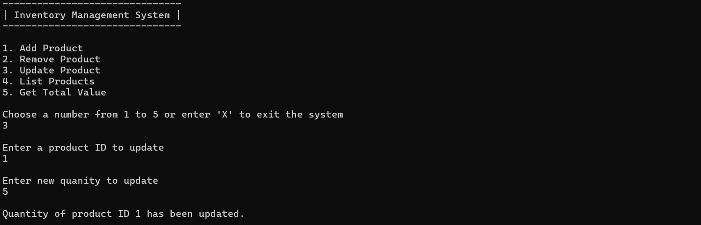
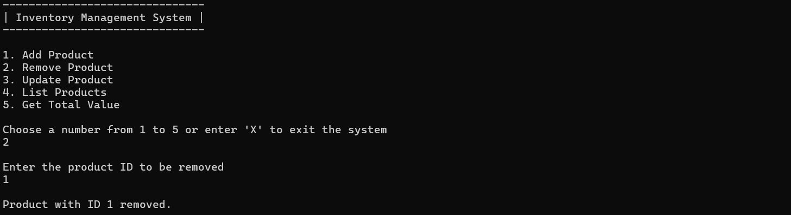

# InventoryManagementSystem-CRUD

<html>
 <head>
 </head>
  <body>
    <h2>Add Product</h2>
    
    <h2>View Product List</h2>
    
    <h2>Update Product</h2>
    
    <h2>Delete Product</h2>
    
  </body>
</html>
